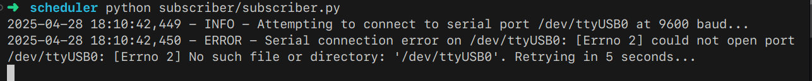
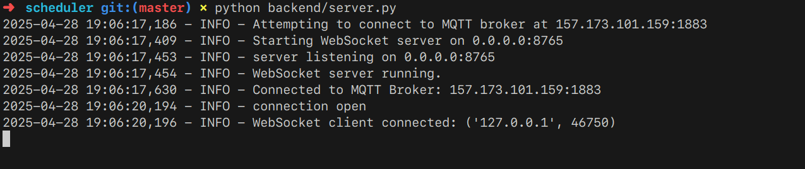

# Web-Based Light Scheduler

This project implements a simple IoT system to schedule a light (connected to an Arduino relay) via a web interface.

**Architecture:**

1.  **Frontend (HTML/CSS/JS):** A web page allows users to input ON and OFF times.
2.  **WebSocket Server (Python/websockets):** Receives the schedule from the frontend via WebSocket.
3.  **MQTT Broker (Mosquitto):** The WebSocket server forwards the received schedule as a JSON payload to an MQTT topic.
4.  **MQTT Subscriber (Python/paho-mqtt/pyserial):** Subscribes to the MQTT topic, receives the schedule, checks the current time against the schedule, and sends commands ('0' for OFF, '1' for ON) to the Arduino via serial communication.
5.  **Arduino:** Executes the received serial commands to control a relay.

## Project Structure

```
light-scheduler/
├── backend/
│   └── websocket_server.py   # WebSocket to MQTT bridge
├── frontend/
│   ├── index.html            # Web interface
│   └── script.js             # Frontend logic (WebSocket client)
├── subscriber/
│   └── mqtt_subscriber.py    # MQTT to Serial controller
├── .gitignore                # Git ignore rules
├── README.md                 # This file
└── requirements.txt          # Python dependencies
```

## Prerequisites

*   **Python 3.8+**
*   **pip** (Python package installer)
*   **Mosquitto MQTT Broker:** Installed and running. You can install it locally or use a public broker (update `MQTT_BROKER_HOST` in the Python scripts if needed).
    *   Debian/Ubuntu: `sudo apt-get update && sudo apt-get install -y mosquitto mosquitto-clients`
    *   macOS (Homebrew): `brew install mosquitto`
*   **Arduino UNO (or compatible):** Programmed to listen for '0' or '1' on the serial port and control a relay accordingly.
*   **Serial Port Permissions (Linux):** Your user might need to be part of the `dialout` group to access the serial port: `sudo usermod -a -G dialout $USER` (Log out and log back in after running this).

## Setup

1.  **Clone the Repository:**
    ```bash
    git clone <your-repo-url>
    cd light-scheduler
    ```

2.  **Create a Virtual Environment (Recommended):**
    ```bash
    python -m venv venv
    source venv/bin/activate  # On Windows use `venv\Scripts\activate`
    ```

3.  **Install Python Dependencies:**
    ```bash
    pip install -r requirements.txt
    ```

4.  **Configure Serial Port (if necessary):**
    *   The `subscriber/mqtt_subscriber.py` script defaults to `/dev/ttyACM0`. 
    *   Identify your Arduino's serial port (e.g., using the Arduino IDE, `dmesg` on Linux, Device Manager on Windows).
    *   You can override the default by setting the `ARDUINO_SERIAL_PORT` environment variable before running the subscriber:
        ```bash
        export ARDUINO_SERIAL_PORT=/dev/ttyUSB0 # Example for Linux
        # set ARDUINO_SERIAL_PORT=COM3          # Example for Windows CMD
        # $env:ARDUINO_SERIAL_PORT="COM3"      # Example for Windows PowerShell
        ```

## Running the System

You need to run three components (ideally in separate terminals):

1.  **MQTT Subscriber:** Listens for schedules and controls the Arduino.
    ```bash
    # (Activate virtual env if not already done)
    # (Set ARDUINO_SERIAL_PORT env variable if needed)
    python subscriber/mqtt_subscriber.py
    ```

2.  **WebSocket Server:** Bridges the web interface to MQTT.
    ```bash
    # (Activate virtual env if not already done)
    python backend/websocket_server.py
    ```

3.  **Frontend:** Open the `frontend/index.html` file in your web browser.
    *   You can usually just double-click the file, or use `file:///path/to/light-scheduler/frontend/index.html`.
    *   Alternatively, use a simple HTTP server for better isolation:
        ```bash
        # From the light-scheduler directory
        python -m http.server --directory frontend 8000 
        ```
        Then navigate to `http://localhost:8000` in your browser.

## Usage

1.  Ensure the MQTT Broker is running.
2.  Start the MQTT Subscriber script.
3.  Start the WebSocket Server script.
4.  Open `frontend/index.html` in your browser.
5.  The status should indicate "Connected".
6.  Select the desired ON and OFF times using the time inputs.
7.  Click "Submit Schedule".
8.  You should see confirmation messages in the browser and logs in the WebSocket Server and MQTT Subscriber terminals.
9.  The light connected to the Arduino should turn ON and OFF according to the submitted schedule. 


### Screenshots

#### Frontend Interface


#### MQTT Subscriber Output


#### WebSocket Server Output

